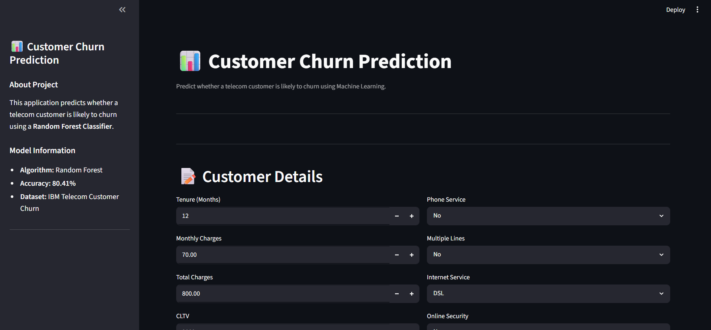

# 📊 Customer Churn Prediction


# 📊 Customer Churn Prediction

A Machine Learning project that predicts whether a telecom customer is likely to churn based on customer demographics, subscription details, and billing information.

---

## 📌 Features

- Data Cleaning & Preprocessing
- Exploratory Data Analysis (EDA)
- Feature Encoding
- Feature Scaling
- Multiple ML Models
- Model Evaluation
- Model Saving using Joblib
- Streamlit Ready

---

## 🛠 Tech Stack

- Python
- Pandas
- NumPy
- Matplotlib
- Scikit-learn
- Joblib
- Jupyter Notebook
- Streamlit

---

## 📂 Dataset

IBM Telecom Customer Churn Dataset

**Target Variable:** `Churn Label`

---

## 🤖 Models Used

- Logistic Regression
- Decision Tree
- Random Forest
- K-Nearest Neighbors (KNN)

---

## 📈 Evaluation Metrics

- Accuracy
- Precision
- Recall
- F1-Score
- Confusion Matrix
- Classification Report

---

## 🏆 Best Result

**Logistic Regression**

- Accuracy: **96.52%**

---

## 📁 Project Structure

```text
Customer-Churn-Prediction
│
├── app/
├── data/
├── images/
├── models/
├── notebooks/
├── README.md
├── requirements.txt
└── LICENSE
```

---

## 🚀 Getting Started

Clone the repository

```bash
git clone https://github.com/RahulUbale06/Customer-Churn-Prediction.git
```

Install dependencies

```bash
pip install -r requirements.txt
```

Run the notebook

```bash
jupyter notebook
```

Run the Streamlit app

```bash
streamlit run app/app.py
```

---

## Application Preview
### Home Page



### Prediction


## 📌 Future Improvements

- Hyperparameter Tuning
- XGBoost Implementation
- Feature Importance Dashboard
- Cloud Deployment

---

## 👨‍💻 Author

**Rahul Ubale**

GitHub: https://github.com/RahulUbale06